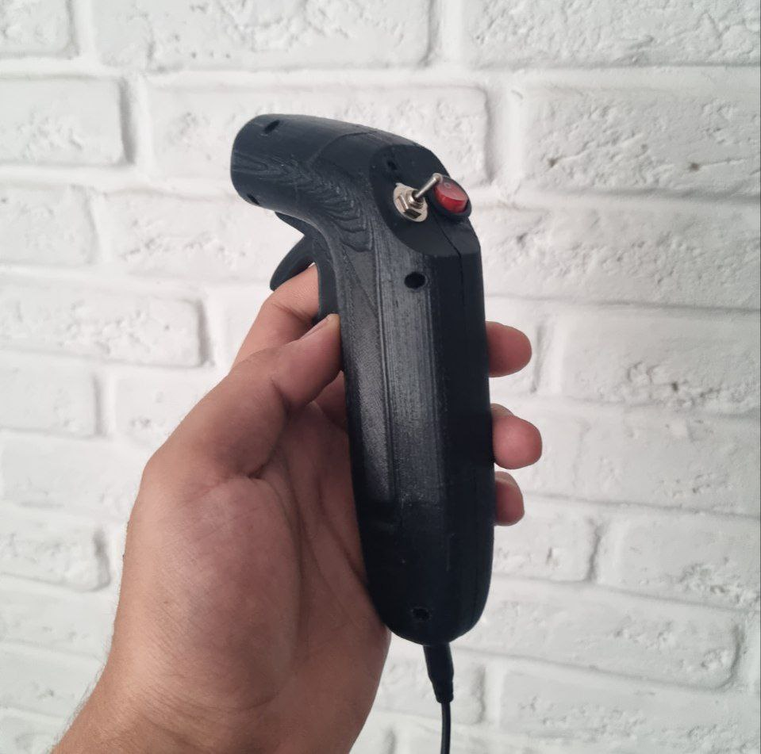

# rMotionController

-------------------------------------------------------------------------------------------------------- 

###### Inspired by Novoselov's hand motion controller - [link](https://github.com/NovoselovMilk/Hand_Controller)

<iframe width="560" height="315" src="https://www.youtube.com/embed/b5Prc8Tttrw?si=sEyZa0WieyCZ01ko" title="YouTube video player" frameborder="0" allow="accelerometer; autoplay; clipboard-write; encrypted-media; gyroscope; picture-in-picture; web-share" allowfullscreen></iframe>

### Requirements:

##### Hardware:

- MPU6050 or Other Gyro/Accel module
- Arduino Nano (old) or Pro Micro or other with I2C and USB Serial

##### Software:

- [Arduino IDE](https://www.arduino.cc/en/software) or [VSCode](https://code.visualstudio.com/)
  with [Arduino Extension](https://marketplace.visualstudio.com/items?itemName=vsciot-vscode.vscode-arduino)
- [I2Cdev](https://github.com/jrowberg/i2cdevlib) lib _(P.S. - Project using MPU6050 module in i2cdev folder to simplify
  work with YAW Axis)_
- [PPMEncoder](https://github.com/schinken/PPMEncoder) lib

###### Red Fraction © 2023
